# Jamshedpur Police WhatsApp Chatbot - Full Process Graph

Single top-to-bottom flow for Mermaid 9.4.3.

```mermaid
graph TD
    META["Meta WhatsApp Cloud API"] --> WH["POST /api/webhook"]
    WH --> MSG{"Incoming message type?"}

    MSG -->|"location pin"| HLOC["handleLocationMessage"]
    MSG -->|"image"| HIMG["handleFlowPhotoMessage"]
    MSG -->|"text / button / list"| PCM["processChatbotMessage"]

    HLOC --> NEAR["Nearest Police Station reply"]
    NEAR --> FU

    HIMG --> PHOTO{"Active photo step?"}
    PHOTO -->|"harassment photo"| SAVE_HP["Save Information + photo"]
    PHOTO -->|"missing person photo"| SAVE_MP["Save Missing Person + photo"]
    SAVE_HP --> FU
    SAVE_MP --> FU

    PCM --> HAS_ID{"Has interactive id?"}
    HAS_ID -->|"Yes"| HIR["handleInteractiveResponse"]
    HAS_ID -->|"No"| LANG{"Contact language set?"}

    LANG -->|"No or greeting"| WELCOME["Welcome message + logo"]
    WELCOME --> LANG_BTNS["lang_english or lang_hindi"]
    LANG_BTNS --> DISC["Disclaimer + emergency numbers"]
    DISC --> MENU

    LANG -->|"Yes"| EXIT{"Exit keyword typed?"}
    EXIT -->|"Yes"| CLEAR["Clear flowSession"]
    CLEAR --> MENU
    EXIT -->|"No"| IN_FLOW{"In form or awaiting step?"}
    IN_FLOW -->|"Yes"| FORM_CONT["Continue form or step"]
    IN_FLOW -->|"No"| MENU

    HIR --> NAV{"Interactive id?"}
    NAV -->|"menu"| CLEAR
    NAV -->|"lang buttons"| DISC
    NAV -->|"info_location_skip"| FIN_INFO["Finalize Information no GPS"]
    NAV -->|"harassment_photo_skip"| FIN_HP["Finalize harassment no photo"]
    NAV -->|"missing_photo_skip"| FIN_MP["Finalize missing person no photo"]
    NAV -->|"station pick"| STATION_SAVE["Save petition with station"]
    NAV -->|"service or sub"| BRANCH["Route to service"]

    FIN_INFO --> FU
    FIN_HP --> FU
    FIN_MP --> FU
    STATION_SAVE --> FU
    FORM_CONT --> FORM_DONE{"Form complete?"}
    FORM_DONE -->|"Need next step"| AWAIT["awaiting step"]
    FORM_DONE -->|"Save now"| SAVE_DB["Save to MongoDB"]
    AWAIT --> SAVE_DB
    SAVE_DB --> FU

    MENU["Main Service Menu"] --> S1["service_passport - Passport Issues"]
    MENU --> S2["service_character - Character Verification"]
    MENU --> S3["service_location - Location Service"]
    MENU --> S4["service_lost_phone - Lost Mobile Phone"]
    MENU --> S5["service_traffic - Traffic Issues"]
    MENU --> S6["service_missing_person - Missing Person"]
    MENU --> S7["service_information - Information"]
    MENU --> S8["service_suggestion - Suggestion"]
    MENU --> S9["service_my_activities - My Activities"]
    MENU --> S10["service_change_lang - Change Language"]

    BRANCH --> S1
    BRANCH --> S2
    BRANCH --> S3
    BRANCH --> S4
    BRANCH --> S5
    BRANCH --> S6
    BRANCH --> S7
    BRANCH --> S8
    BRANCH --> S9
    BRANCH --> S10

    S1 --> P_SUB["Passport submenu"]
    P_SUB --> P_D["sub_passport_delay"]
    P_SUB --> P_O["sub_passport_other"]
    P_D --> P_FORM["6-line form then Save Complaint + ID"]
    P_O --> P_FORM
    P_FORM --> FU

    S2 --> C_SUB["Character submenu"]
    C_SUB --> C_D["sub_character_delay"]
    C_SUB --> C_O["sub_character_other"]
    C_D --> C_FORM["6-line form then Save Complaint + ID"]
    C_O --> C_FORM
    C_FORM --> FU

    S3 --> GPS_REQ["Set awaiting_location and request GPS"]
    GPS_REQ --> USER_PIN["User shares GPS pin"]
    USER_PIN --> HLOC

    S4 --> L_SUB["Lost phone submenu"]
    L_SUB --> L_R["sub_lost_mobile - CEIR redirect no save"]
    L_SUB --> L_NS["sub_lost_mobile_not_satisfied"]
    L_R --> MENU
    L_NS --> L_FORM["5-line form then Save"]
    L_FORM --> FU

    S5 --> T_SUB["Traffic submenu"]
    T_SUB --> T_R["sub_traffic_rules - rules and fines"]
    T_SUB --> T_J["sub_traffic_jam - form then Save"]
    T_SUB --> T_C["sub_traffic_challan - form then Save"]
    T_SUB --> T_O["sub_traffic_other - form then Save"]
    T_R --> FU
    T_J --> FU
    T_C --> FU
    T_O --> FU

    S6 --> M_FORM["5-line missing person form"]
    M_FORM --> M_PHOTO["awaiting_missing_person_photo"]
    M_PHOTO -->|"image"| SAVE_MP
    M_PHOTO -->|"missing_photo_skip"| FIN_MP
    M_PHOTO -->|"menu"| MENU

    S7 --> I_SUB["Information submenu"]
    I_SUB --> I_A["sub_info_adebazi"]
    I_SUB --> I_H["sub_info_misbehavior Harassment"]
    I_SUB --> I_D["sub_info_drugs - form then Save"]
    I_SUB --> I_AB["sub_info_absconders"]
    I_SUB --> I_IL["sub_info_illegal - form then Save"]
    I_SUB --> I_OT["sub_info_other - form then Save"]
    I_D --> FU
    I_IL --> FU
    I_OT --> FU

    I_A --> I_FORM_OPT["Form then awaiting_info_location optional"]
    I_AB --> I_FORM_OPT
    I_FORM_OPT -->|"GPS pin"| FIN_INFO
    I_FORM_OPT -->|"info_location_skip"| FIN_INFO
    I_FORM_OPT -->|"menu"| MENU

    I_H --> I_FORM_REQ["Form then awaiting_info_location required"]
    I_FORM_REQ -->|"GPS pin"| H_PHOTO["awaiting_harassment_photo"]
    I_FORM_REQ -->|"menu"| MENU
    H_PHOTO -->|"image"| SAVE_HP
    H_PHOTO -->|"harassment_photo_skip"| FIN_HP
    H_PHOTO -->|"menu"| MENU

    S8 --> SUG["suggestion_form 6 lines"]
    SUG --> REV["Save as Review"]
    REV --> FU

    S9 --> ACT["List user complaints by phone"]
    ACT --> FU

    S10 --> CL["Show opposite language button"]
    CL --> LANG_BTNS

    FU["Follow-up auto-send Main Service Menu"] --> MENU
```

## How to read it

1. **Top:** Meta sends every WhatsApp event to `/api/webhook`.
2. **Split:** location to nearest PS; image to photo finalize; text/buttons to chatbot router.
3. **Gate:** new users pick language; existing users continue a form, exit to menu, or open the main list.
4. **Middle:** all 10 services fan out to submenus, forms, GPS, and photos.
5. **Bottom:** every successful path hits **Follow-up Menu**, which loops back to the Main Service Menu.
